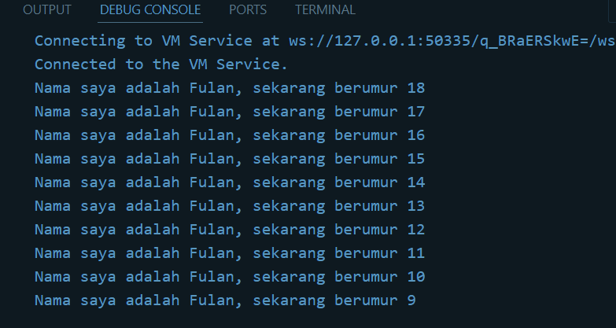

# Tugas Praktikum 2

1. Modifikasilah kode pada baris 3 di VS Code atau Editor Code favorit Anda berikut ini agar mendapatkan keluaran (output) sesuai yang diminta!
### Jawab :
```void main() {
    for (int i = 18; i > 8; i--) {
        print('Nama saya adalah Fulan, sekarang berumur ${i}');
    }
}
```



2. Mengapa sangat penting untuk memahami bahasa pemrograman Dart sebelum kita menggunakan framework Flutter ? Jelaskan!
### Jawab :
Dart merupakan bahasa yang digunakan dalam oleh Flutter dimana kode aplikasi, kode plugin, dan menajemen dependensi itu menggunakan bahasa Dart. Maka dari itu penting untuk memahami bahasa Dart sangat pentig agar bisa menulis kode flutter dengan benar, memahami cara kerja, dan gaya pemrograman yang dibutuhkan untuk membangun aplikasi Flutter yang efisien dan efektif

3. Rangkumlah materi dari codelab ini menjadi poin-poin penting yang dapat Anda gunakan untuk membantu proses pengembangan aplikasi mobile menggunakan framework Flutter.
### Jawab :
# Sejarah dan Pengertian Dart 
Dart diluncurkan pada tahun 2011 dan berkembang pesat sejak itu, dengan versi stabil pertama dirilis pada tahun 2013 dan pembaruan besar pada Dart 2.0 pada akhir 2018. Awalnya, Dart berfokus pada pengembangan web sebagai pengganti JavaScript, namun sekarang lebih berfokus pada pengembangan mobile, terutama dengan framework Flutter. Dart dirancang untuk mengatasi beberapa kekurangan JavaScript, seperti kurangnya ketahanan yang dimiliki banyak bahasa pemrograman lainnya. Dart juga menawarkan performa optimal dan alat modern yang cocok untuk proyek berskala besar, dengan dukungan plugin IDE yang stabil. Bahasa ini fleksibel dan kuat, dengan type annotations opsional dan fitur-fitur OOP, memungkinkan keseimbangan antara fleksibilitas dan ketangguhan.

Dart adalah bahasa pemrograman tingkat tinggi, mendukung lintas platform, dan memiliki tujuan umum dengan terus meningkatkan fitur-fiturnya, membuatnya lebih kekinian dan fleksibel yang menjadi inti dari framework flutter.

# Fitur Dart
- Productive tooling: untuk menganalisis kode, plugin IDE, dan ekosistem paket yang besar.
- Garbage collection: untuk mengelola atau menangani dealokasi memori (terutama memori yang ditempati oleh objek yang tidak lagi digunakan).
- Type annotations (opsional): untuk keamanan dan konsistensi dalam mengontrol semua data dalam aplikasi.
- Statically typed: Meskipun type annotations bersifat opsional, Dart tetap aman karena menggunakan fitur type-safe dan type inference untuk menganalisis types saat runtime. Fitur ini penting untuk menemukan bug selama kompilasi kode.
- Portability: bahasa Dart tidak hanya untuk web (yang dapat diterjemahkan ke JavaScript) tetapi juga dapat dikompilasi secara native ke kode Advanced RISC Machines (ARM) dan x86.

# Cara Kerja Dart
Dart dapat dieksekusi melalui dua metode utama, yaitu Dart Virtual Machines (VMs) dan kompilasi JavaScript.

## Dart Vms
- Kompilasi Just in Time (JIT) : Kode Dart dikompilasi secara dinamis saat runtime, mendukung fitur seperti hot reload dan debugging. Ideal untuk pengembangan aplikasi.
- Kompilasi AOT (Ahead-Of-Time): Kode Dart dikompilasi sebelumnya menjadi kode mesin, memberikan performa tinggi tetapi tidak mendukung hot reload.

## Javascript
Kode Dart dapat dikompilasi menjadi JavaScript untuk dijalankan di lingkungan yang mendukung JavaScript, seperti browser web.

## Apa itu Hot Reload
Hot Reload adalah fitur terkenal Flutter yang didukung oleh kompiler Dart JIT. Ini memungkinkan pengembang melihat perubahan kode secara instan, mempercepat pengembangan dan meningkatkan kualitas perangkat lunak.

# Struktur Bahasa Dart
Sintaks : Dart menyediakan operator standar, tipe data built-in, serta kontrol alur dan fungsi yang mirip dengan bahasa lain seperti C++, Java.

Dart adalah bahasa berorientasi objek (OO) yang menggunakan konsep objek untuk menyimpan data dan metode. Dart mendukung fitur OO seperti enkapsulasi, pewarisan, komposisi, abstraksi, dan polimorfisme.

## Operator :
### Operator Aritmatika:
- (+) penambahan
- (-) pengurangan
- (*) perkalian
- (/) pembagian, menghasilkan double
- (~/) pembagian bilangan bula
- (%) modulus
- (-expression) negasi
### Operator Penambahan dan Pengurangan:
- ++var atau var++ (menambah nilai 1)
- --var atau var-- (mengurangi nilai 1)
### Operator Kesetaraan dan Relasional:
- == (kesetaraan)
- != (ketidaksamaan)
- > (lebih besar dari)
- < (kurang dari)
- >= (lebih besar dari atau sama dengan)
- <= (kurang dari atau sama dengan)
### Operator Logika:
- !expression (negasi)
- || (OR)
- && (AND)

3. Buatlah slide yang berisi penjelasan dan contoh eksekusi kode tentang perbedaan Null Safety dan Late variabel ! (Khusus soal ini kelompok berupa link google slide)

### Jawab :

## Null Safety
- Null Safety mencegah nilai null yang tidak diharapkan pada variabel dan bertujuan untuk mengurangi kesalahan null reference yang sering terjadi pada runtime.
- Variabel harus diinisialisasi dengan nilai non-null atau dideklarasikan sebagai nullable (menggunakan tanda ?).

contoh : String? nama;

## Late Variable
- Late Variable memungkinkan kita untuk menunda inisialisasi variabel hingga saat diperlukan. Sangat berguna untuk variabel yang membutuhkan proses inisialisasi yang mahal atau data yang belum tersedia saat deklarasi.
- late digunakan ketika kita ingin memastikan bahwa variabel akan diinisialisasi nanti sebelum digunakan.

contoh : late String namaLengkap;

## Perbedaan Null Safety dan Late Variable
Null Safety
- Tujuan: Mencegah nilai null yang tidak diharapkan pada variabel.
- Deklarasi Variabel: Variabel harus diinisialisasi dengan nilai non-null atau dideklarasikan sebagai nullable menggunakan tanda ?.
- Keamanan: Mengurangi risiko kesalahan null reference pada runtime.
- Contoh: String? nama (nullable)

Late Variable
- Tujuan: Menunda inisialisasi variabel hingga saat diperlukan.
- Deklarasi Variabel: Variabel dideklarasikan dengan kata kunci late dan dapat diinisialisasi nanti sebelum digunakan.
- Penggunaan: Berguna untuk variabel yang memerlukan inisialisasi yang lebih kompleks atau bergantung pada data yang tersedia kemudian.
- Contoh: late String nama yang diinisialisasi sebelum digunakan.