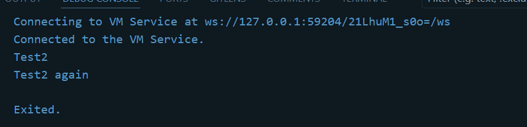
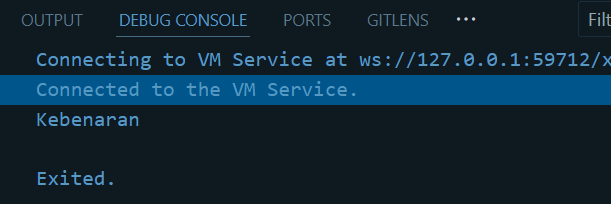
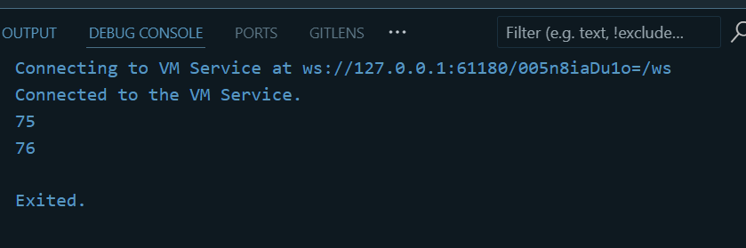
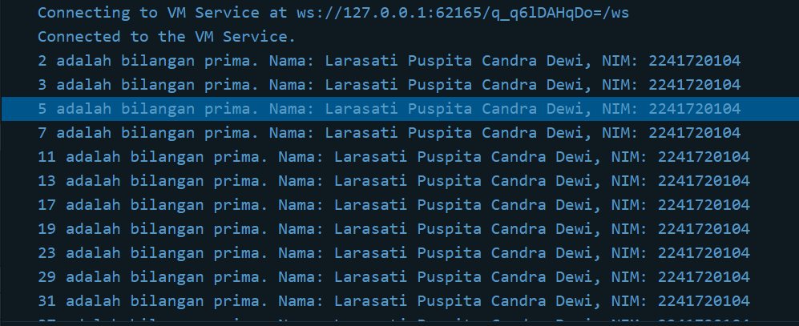

## Praktikum 1: Menerapkan Control Flows ("if/else")
Langkah 1 :
``` void main(){
  String test = "test2";
if (test == "test1") {
   print("Test1");
} else If (test == "test2") {
   print("Test2");
} Else {
   print("Something else");
}
if (test == "test2") print("Test2 again");
} 
```
Langkah 2 :
Silakan coba eksekusi (Run) kode pada langkah 1 tersebut. Apa yang terjadi? Jelaskan!
Jawab: tidak bisa di run karena ada penulisan kode program yang salah diatas. Berikut kode program yang benar dan hasilnya.

``` void main(){
  String test = "test2";
if (test == "test1") {
   print("Test1");
} else if (test == "test2") {
   print("Test2");
} else {
   print("Something else");
}
if (test == "test2") print("Test2 again");
}
```
Hasil :


Langkah 3 :
Tambahkan kode program berikut, lalu coba eksekusi (Run) kode Anda.
Apa yang terjadi ? Jika terjadi error, silakan perbaiki namun tetap menggunakan if/else.
Jawab : Terjadi error karena tidak terdapat nilai pembandingnya.

Revisi Code :
``` String test = "true";
if (test == "true") {
   print("Kebenaran");
}
```
Hasil :


## Praktikum 2: Menerapkan Perulangan "while" dan "do-while"

Langkah 1
Ketik atau salin kode program berikut ke dalam fungsi main().
``` void main(){
// langkah 1
while (counter < 33) {
  print(counter);
  counter++;
}
}
```

Langkah 2
Silakan coba eksekusi (Run) kode pada langkah 1 tersebut. Apa yang terjadi? Jelaskan! Lalu perbaiki jika terjadi error.
Terjadi error dikarenakan belum mendeklarasi dan menginisialiasi variabel counter.

Revisi Code :
``` void main(){
// langkah 1
int counter = 25;
while (counter < 33) {
  print(counter);
  counter++;
}
}
```

Hasil :


Langkah 3 :
Tambahkan kode program berikut, lalu coba eksekusi (Run) kode Anda.
Apa yang terjadi ? Jika terjadi error, silakan perbaiki namun tetap menggunakan do-while.
Code Program :
``` counter = 75;
do {
  print(counter);
  counter++;
} while (counter < 77);
```
Hasil :


## Praktikum 3

Langkah 1 :

```void main (){
  for (Index = 10; index < 27; index) {
  print(Index);
}
}
```

Langkah 2 :
Silakan coba eksekusi (Run) kode pada langkah 1 tersebut. Apa yang terjadi? Jelaskan! Lalu perbaiki jika terjadi error.
Jawab : Error karena variabel Integer belum diinisialisasi dan ada penulisan sintaksnya yang salah.

Revisi Kode 
``` void main (){
  for (int Index = 10; Index < 27; Index) {
  print(Index);
}
}
```

Langkah 3
Apa yang terjadi ? Jika terjadi error, silakan perbaiki namun tetap menggunakan for dan break-continue.

Revisi Kode :
``` void main() {
  // langkah 1
  for (int Index = 10; Index < 27; Index++) {
    // langkah 3
    if (Index == 21) break;
    else if (Index > 1 && Index < 7) continue;
    print(Index);
  }
}
```
Hasil : 


## Tugas No 2
``` 
void main() {
  String nama = "Larasati Puspita Candra Dewi";
  String nim = "2241720104";

  bool isPrima(int bil) {
    if (bil <= 1) return false;
    for (int i = 2; i * i <= bil; i++) {
      if (bil % i == 0) return false;
    }
    return true;
  }

  for (int i = 0; i <= 201; i++) {
    if (isPrima(i)) {
      print('$i adalah bilangan prima. Nama: $nama, NIM: $nim');
    }
  }
  
}
``` 

Hasil :
