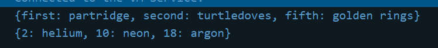
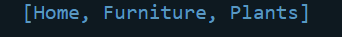

## Praktikum 1: Eksperimen Tipe Data List
Langkah 1 
``` void main() {
  var list = [1, 2, 3];
  assert(list.length == 3);
  assert(list[1] == 2);
  print(list.length);
  print(list[1]);

  list[1] = 1;
  assert(list[1] == 1);
  print(list[1]);
} 
```
Langkah 2 

Silakan coba eksekusi (Run) kode pada langkah 1 tersebut. Apa yang terjadi? Jelaskan!
Jawab : Yang terjadi adalah menghasilkan nilai 3,2,1. Nilai 3 didapat dari pengecekan panjang(length) dari list tersebut dan di print jumlah length nya. Nilai 2 didapat dari pengecekan list dengan indeks 1 apakah benar valuenya 2 dan di print . Nilai 1 didapat dari perubahan isi list indeks ke 1.

Langkah 3 

Ubah kode pada langkah 1 menjadi variabel final yang mempunyai index = 5 dengan default value = null. Isilah nama dan NIM Anda pada elemen index ke-1 dan ke-2. Lalu print dan capture hasilnya.

``` 
void main() {
  var list = ['Larasati Puspita Candra Dewi', '2241720104', null, null, null];
  assert(list.length == 3);
  assert(list[1] == 2);
  print(list.length);
  print(list[1]);

  list[1] = 1;
  assert(list[1] == 1);
  print(list[1]);
}
```
Apa yang terjadi ? Jika terjadi error, silakan perbaiki.
Jawab : Terjadi error pada saat pengecekan jumlah length dari list dan pengecekan isi indeks ke 1 itu salah.

Code perbaikan :
``` 
void main() {
  var list = ['Larasati Puspita', 2241720104 , null, null, null];
  assert(list.length == 5);
  assert(list[1] == 2241720104);
  print(list.length);
  print(list[1]);

  list[1] = 1;
  assert(list[1] == 1);
  print(list[1]);
}
```
Hasil :


## Praktikum 2: Eksperimen Tipe Data Set
Langkah 1
``` 
void main(){
  var halogens = {'fluorine', 'chlorine', 'bromine', 'iodine', 'astatine'};
  print(halogens);
}
```
Langkah 2
Silakan coba eksekusi (Run) kode pada langkah 1 tersebut. Apa yang terjadi? Jelaskan! Lalu perbaiki jika terjadi error.
Jawab : Tidak terjadi error dan dilakukan cetak semua nilai dari halogens. 


Langkah 3 
Tambahkan kode program berikut, lalu coba eksekusi (Run) kode Anda.
``` 
void main() {
  var halogens = {'fluorine', 'chlorine', 'bromine', 'iodine', 'astatine'};
  print(halogens);

  var names1 = <String>{};
  Set<String> names2 = {}; // This works, too.
  var names3 = {}; // Creates a map, not a set.

  print(names1);
  print(names2);
  print(names3);
}

```
Apa yang terjadi ? Jika terjadi error, silakan perbaiki namun tetap menggunakan ketiga variabel tersebut. Tambahkan elemen nama dan NIM Anda pada kedua variabel Set tersebut dengan dua fungsi berbeda yaitu .add() dan .addAll(). Untuk variabel Map dihapus, nanti kita coba di praktikum selanjutnya.

Jawab : Tidak terjadi error namun tidak ada data yang tertampil.

Code Perbaikan :
``` 
void main() {
  var halogens = {'fluorine', 'chlorine', 'bromine', 'iodine', 'astatine'};
  print(halogens);

  var names1 = <String>{};
  Set<String> names2 = {}; // This works, too.
  names1.add('Larasati Puspita');
  names2.add('2241720104');

  print(names1);
  print(names2);
}
```
## Praktikum 3: Eksperimen Tipe Data Maps
Langkah 1
```
void main(){
  var gifts = {
  // Key:    Value
  'first': 'partridge',
  'second': 'turtledoves',
  'fifth': 1
};

var nobleGases = {
  2: 'helium',
  10: 'neon',
  18: 2,
};

print(gifts);
print(nobleGases);
}
```
Langkah 2 

Silakan coba eksekusi (Run) kode pada langkah 1 tersebut. Apa yang terjadi? Jelaskan! Lalu perbaiki jika terjadi error.
Jawab : Pada pemgrograman diatas variable nobleGases dan gift menggunakan tipe data Maps yang kemudian semua value didalamnya di cetak. 

Hasil :


Langkah 3
```
void main(){
  var gifts = {
  // Key:    Value
  'first': 'partridge',
  'second': 'turtledoves',
  'fifth': 1
};

var nobleGases = {
  2: 'helium',
  10: 'neon',
  18: 2,
};

var mhs1 = Map<String, String>();
gifts['first'] = 'partridge';
gifts['second'] = 'turtledoves';
gifts['fifth'] = 'golden rings';

var mhs2 = Map<int, String>();
nobleGases[2] = 'helium';
nobleGases[10] = 'neon';
nobleGases[18] = 'argon';

print(gifts);
print(nobleGases);

}
```
Apa yang terjadi ? Jika terjadi error, silakan perbaiki.
Hasil :


Jawab : variabel mhs1 mengubah nilaai elemen pada gifts dan variabel mhs2 mengubah nilai elemen pada nobleGases.

Tambahkan elemen nama dan NIM Anda pada tiap variabel di atas (gifts, nobleGases, mhs1, dan mhs2).

Jawab:
```
void main(){
  var gifts = {
  // Key:    Value
  'first': 'partridge',
  'second': 'turtledoves',
  'fifth': 1,
  'third': 'Larasati Puspita',
  'fourth': 2241720104
};

var nobleGases = {
  2: 'helium',
  10: 'neon',
  18: 2,
  11: 'Larasati Puspita',
  12: 2241720104
};

var mhs1 = Map<String, String>();
gifts['first'] = 'partridge';
gifts['second'] = 'turtledoves';
gifts['fifth'] = 'golden rings';
mhs1['nama'] = 'Larasati Puspita';
mhs1['nim'] = '2241720104';

var mhs2 = Map<int, String>();
nobleGases[2] = 'helium';
nobleGases[10] = 'neon';
nobleGases[18] = 'argon';
mhs2[1] = 'Larasati Puspita';
mhs2[2] = '2241720104';

print(gifts);
print(nobleGases);
print(mhs1);
print(nobleGases);

}
```
Hasil :


## Praktikum 4: Eksperimen Tipe Data List: Spread dan Control-flow Operators

Langkah 1
``` 
void main() {
  var list = [1, 2, 3];
  var list2 = [0, ...list];
  print(list1);
  print(list2);
  print(list2.length);
}
```
Langkah 2

Silakan coba eksekusi (Run) kode pada langkah 1 tersebut. Apa yang terjadi? Jelaskan! Lalu perbaiki jika terjadi error.

Jawab :
terjadi error karena mencetak variabel list1 namun belum membuatnya.

Code Perbaikan
```
void main() {
  var list1 = [1, 2, 3];
  var list2 = [0, ...list1];
  print(list1);
  print(list2);
  print(list2.length);
}
```
Hasil :


Langkah 3
```
void main() {
  var list1 = [1, 2, 3];
  var list2 = [0, ...list1];
  print(list1);
  print(list2);
  print(list2.length);

  list1 = [1, 2, null];
  print(list1);
  var list3 = [0, ...?list1];
  print(list3.length);
}
```
Apa yang terjadi ? Jika terjadi error, silakan perbaiki.
Tambahkan variabel list berisi NIM Anda menggunakan Spread Operators.

Jawab : Terjadi error karena tidak bisa menyimpan null dalam variabel bertipe integer. Maka null saya ubah menjadi 0.

Kode Perbaikan :
```
void main() {
  var list1 = [1, 2, 3];
  var list2 = [0, ...list1];
  print(list1);
  print(list2);
  print(list2.length);

  var nim = [2241720104];
  list1 = [1, 2, 0];
  print(list1);
  var list3 = [0, ...list1, ...nim];
  print(list3.length);
  print(list3);
}
```
Hasil :


Langkah 4
```
void main() {
  var list1 = [1, 2, 3];
  var list2 = [0, ...list1];
  print(list1);
  print(list2);
  print(list2.length);

  var nim = [2241720104];
  list1 = [1, 2, 0];
  print(list1);
  var list3 = [0, ...list1, ...nim];
  print(list3.length);
  print(list3);

  var nav = ['Home', 'Furniture', 'Plants', if (promoActive) 'Outlet'];
  print(nav);
}
```
Apa yang terjadi ? Jika terjadi error, silakan perbaiki. Tunjukkan hasilnya jika variabel promoActive ketika true dan false.

Jawab : Terjadi error karena kita belum mendeklarasikan variable promoActive. 

Kode Perbaikan :
```
void main() {
  var list1 = [1, 2, 3];
  var list2 = [0, ...list1];
  print(list1);
  print(list2);
  print(list2.length);

  var nim = [2241720104];
  list1 = [1, 2, 0];
  print(list1);
  var list3 = [0, ...list1, ...nim];
  print(list3.length);
  print(list3);

  var promoActive = true;
  var nav = ['Home', 'Furniture', 'Plants', if (promoActive) 'Outlet'];
  print(nav);
}
```
Penjelasan : Dari kode diatas jika kondisi promoActive true maka akan mencetak


Jika false maka akan mencetak berikut


Langkah 5

```
void main() {
  var list1 = [1, 2, 3];
  var list2 = [0, ...list1];
  print(list1);
  print(list2);
  print(list2.length);

  var nim = [2241720104];
  list1 = [1, 2, 0];
  print(list1);
  var list3 = [0, ...list1, ...nim];
  print(list3.length);
  print(list3);

  var promoActive = true;
  var nav = ['Home', 'Furniture', 'Plants', if (promoActive) 'Outlet'];
  print(nav);

  var login = 'Manager';
  var nav2 = ['Home', 'Furniture', 'Plants', if (login case 'Manager') 'Inventory'];
  print(nav2);
}
```
Hasil :

Apa yang terjadi ? Jika terjadi error, silakan perbaiki. Tunjukkan hasilnya jika variabel login mempunyai kondisi lain.
Jawab : terjadi error karena belum mendeklarasikan variabel login. kode diatas sudah saya perbaiki. Jika pada variabel login saya ganti isinya maka Inventory tidak akan dicetak.


Langkah 6
```
void main() {
  var list1 = [1, 2, 3];
  var list2 = [0, ...list1];
  print(list1);
  print(list2);
  print(list2.length);

  var nim = [2241720104];
  list1 = [1, 2, 0];
  print(list1);
  var list3 = [0, ...list1, ...nim];
  print(list3.length);
  print(list3);

  var promoActive = true;
  var nav = ['Home', 'Furniture', 'Plants', if (promoActive) 'Outlet'];
  print(nav);

  var login = 'Staff';
  var nav2 = [
    'Home',
    'Furniture',
    'Plants',
    if (login case 'Manager') 'Inventory'
  ];
  print(nav2);

  var listOfInts = [1, 2, 3];
  var listOfStrings = ['#0', for (var i in listOfInts) '#$i'];
  assert(listOfStrings[1] == '#1');
  print(listOfStrings);
}

```
Apa yang terjadi ? Jika terjadi error, silakan perbaiki. Jelaskan manfaat Collection For dan dokumentasikan hasilnya.

Jawab: Manfaat collection for adalah untuk memperingkas kode daripada harus menggunakan perulangan manual.
Membuat daftar baru listOfStrings.
Mengiterasi setiap elemen dalam daftar listOfInts.
Menghasilkan elemen baru dengan format '#i' untuk setiap elemen i.
Menambahkan elemen baru tersebut ke dalam daftar listOfStrings.
Memeriksa apakah elemen kedua dalam daftar listOfStrings sesuai dengan yang diharapk

## Praktikum 5: Eksperimen Tipe Data Records
Langkah 1
```
void main() {
  var record = ('first', a: 2, b: true, 'last');
  print(record);
}
```

Langkah 2
Silakan coba eksekusi (Run) kode pada langkah 1 tersebut. Apa yang terjadi? Jelaskan! Lalu perbaiki jika terjadi error.
Hasil :


Jawab : Kode program di atas menunjukkan penggunaan dasar record untuk membuat struktur data sederhana. record dapat sangat bermanfaat dalam berbagai situasi pemrograman dimana dapat berbagai jenis variabel jadi satu.

Langkah 3
```
(int, int) tukar((int, int) record) {
  var (a, b) = record;
  return (b, a);
}
void main() {
  var record = ('first', a: 2, b: true, 'last');
  print(record);
}
```
Hasil :


Langkah 4
```
void main() {
  var record = ('first', a: 2, b: true, 'last');
  print(record);

  (String, int) mahasiswa = ('Larasati Puspita Candra Dewi', 2241720104);
  print(mahasiswa);

  (int, int) tukar((int, int) record) {
  var (a, b) = record;
  return (b, a);
}
}
```
Hasil :


Langkah 5
```
void main() {
  var record = (1, 2);
  record = tukar(record);
  print(record);

  (String, int) mahasiswa = ('Larasati Puspita Candra Dewi', 2241720104);
  print(mahasiswa);

  var mahasiswa2 = ('Larasati Puspita Candra Dewi', a: 2, b: true, '2241720104');

  print(mahasiswa2.$1); // Prints 'first'
  print(mahasiswa2.a); // Prints 2
  print(mahasiswa2.b); // Prints true
  print(mahasiswa2.$2); // Prints 'last'
}

(int, int) tukar((int, int) record) {
  var (a, b) = record;
  return (b, a);
}
```
Hasil :


## Tugas Praktikum
1. Silakan selesaikan Praktikum 1 sampai 5, lalu dokumentasikan berupa screenshot hasil pekerjaan Anda beserta penjelasannya!
2. Jelaskan yang dimaksud Functions dalam bahasa Dart!

Jawab : 
blok kode yang bisa dipanggil dan digunakan di dalam program dimana fungsi dapat mengambil parameter, mengembalikan nilai, atau bisa tidak mengembalikan nilai

3. Jelaskan jenis-jenis parameter di Functions beserta contoh sintaksnya!
Jawab :
a. Required Parameter (parameter wajib yang harus diisi saat memanggil fungsi)
```
void greet(String name) {
  print('Hello, $name!');
}

greet('Laras'); 
// Output: Hello, Laras!
```
b. Optional Positional Parameter (parameter yang boleh diisi atau tidak)
```
void greetWithAge(String name, [int age]) {
  if (age != null) {
    print('Hello, $name! You are $age years old.');
  } else {
    print('Hello, $name!');
  }
}

greetWithAge('Laras'); // Output: Hello, Laras!
greetWithAge('Bob', 30); // Output: Hello, Bob! You are 30 years old.
```
c. Named Parameter (parameter yang diberi nama dan bisa diisi dalam urutan bebas)
```
void greetWithNameAndAge({String name, int age}) {
  print('Hello, $name! You are $age years old.');
}

greetWithNameAndAge(age: 20, name: 'Laras'); // Output: Hello, Laras! You are 20 years old.
```
d. Default Parameter (parameter yang memiliki nilai default jika tidak diisi saat pemanggilan)
```
void greetWithGreeting(String name, {String greeting = 'Hello'}) {
  print('$greeting, $name!');
}

greetWithGreeting('David'); // Output: Hello, David!
greetWithGreeting('Eva', greeting: 'Hi'); // Output: Hi, Eva!
```
e. Optional Named (Kombinasi dari named dan default parameter memberikan fleksibilitas yang tinggi dalam penggunaan fungsi.)
```
void greetWithDetails({String name, int age = 30, bool isStudent = true}) {
  // ...
}
```
4. Jelaskan maksud Functions sebagai first-class objects beserta contoh sintaknya!
Fungsi sebagai objek kelas pertama di Dart artinya kita bisa memperlakukan fungsi seperti variabel biasa. Kita bisa menyimpan fungsi dalam variabel, mengirimnya sebagai argumen ke fungsi lain, atau bahkan mengembalikan fungsi dari fungsi lain. Ini membuat kode kita jadi lebih fleksibel dan memungkinkan kita untuk membuat struktur kode yang lebih kompleks dan menarik. Misalnya, kita bisa membuat fungsi yang membuat fungsi lain, atau membuat daftar fungsi yang bisa kita panggil kapan saja.
```
// Fungsi sebagai variabel
void sayHello() {
  print('Hello!');
}

var greeting = sayHello;
greeting(); // Output: Hello!

// Fungsi sebagai argumen
void doSomething(Function myFunction) {
  myFunction();
}

doSomething(sayHello); // Memanggil fungsi sayHello melalui doSomething

// Fungsi sebagai nilai kembalian
Function createGreeter(String name) {
  return () {
    print('Hello, $name!');
  };
}

var greetJohn = createGreeter('Laras');
greetJohn(); // Output: Hello, Laras!
```
5. Apa itu Anonymous Functions? Jelaskan dan berikan contohnya!
Jawab : fungsi yang tidak memiliki nama. Fungsi ini seringkali digunakan secara langsung di tempat mereka didefinisikan, tanpa perlu diberi nama terlebih dahulu. Fungsi anonim sangat berguna ketika kita hanya membutuhkan fungsi sekali pakai atau untuk membuat kode yang lebih ringkas.
```
// Fungsi anonim untuk mencetak pesan "Hello, World!"
() {
  print('Hello, World!');
}();
```
6. Jelaskan perbedaan Lexical scope dan Lexical closures! Berikan contohnya!
Jawab :
- Lexical scope adalah tentang di mana sebuah variabel dapat diakses dalam kode. Digunakan dalam semua bahasa pemrograman untuk mengatur akses ke variabel
```
void outerFunction() {
  String name = "John";

  void innerFunction() {
    print("Hello, $name!"); // Dapat mengakses name karena berada dalam scope yang sama
  }

  innerFunction();
}
outerFunction();
```
- Lexical closure adalah tentang bagaimana sebuah fungsi dapat "mengingat" variabel-variabel dari luar lingkupnya.berguna untuk membuat fungsi yang bersifat dinamis dan fleksibel, seperti callback
```
Function createGreeter(String name) {
  return () {
    print('Hello, $name!');
  };
}

var greetJohn = createGreeter('John');
greetJohn(); // Output: Hello, John!
```
7. Jelaskan dengan contoh cara membuat return multiple value di Functions!
Dalam banyak situasi pemrograman, sebuah operasi atau perhitungan dapat menghasilkan lebih dari satu hasil yang saling terkait maka kita membutuhkan return multiple value. Berikut contoh penggunaan di tipe data List dimana dia mengembalikan nilai area dan perimeter
```
List<int> calculateAreaAndPerimeter(int radius) {
  double area = 3.14 * radius * radius;
  double perimeter = 2 * 3.14 * radius;
  return [area, perimeter];
}
```
8. Kumpulkan berupa link commit repo GitHub pada tautan yang telah disediakan di grup Telegram!


